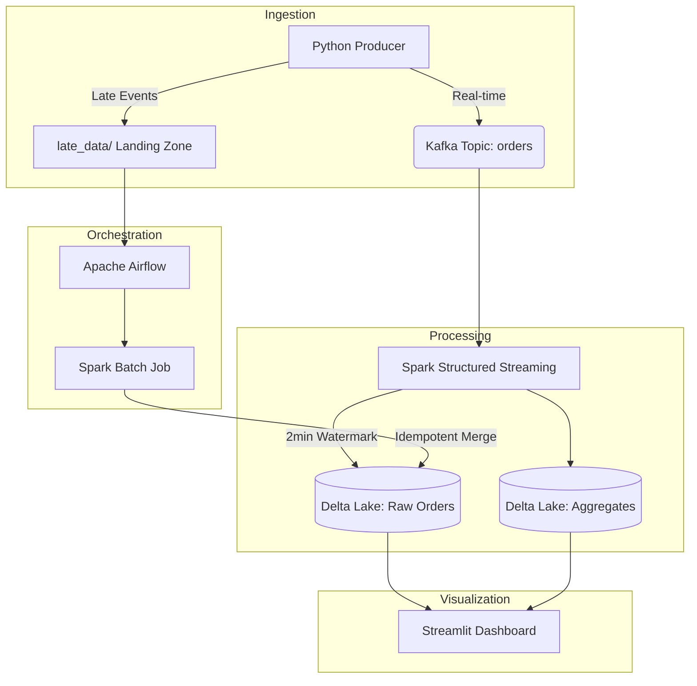

# Real-Time ETL Pipeline: Late-Data Management

[](https://www.python.org/downloads/)
[](https://spark.apache.org/)
[](https://kafka.apache.org/)
[](https://delta.io/)

A robust Data Engineering pipeline designed to handle the challenges of late-arriving data in streaming architectures. This project implements a hybrid approach using Spark Structured Streaming for real-time processing and Apache Airflow for automated batch backfilling of late events into a Delta Lakehouse.

---

## Architecture



---

## Tech Stack

*   **Compute:** Apache Spark (Structured Streaming & PySpark)
*   **Message Broker:** Apache Kafka
*   **Lakehouse Storage:** Delta Lake (Local S3-compatible structure)
*   **Orchestrator:** Apache Airflow
*   **Dashboard:** Streamlit & Plotly
*   **Infrastructure:** Docker & Docker Compose

---

## Core Features

### 1. Real-Time Watermarking
The streaming job uses event-time watermarking (`withWatermark`) to handle data arriving up to 2 minutes late. This ensures accurate windowed aggregations without waiting indefinitely for delayed events.

### 2. Late Data Landing Zone
Events that fall outside the watermark threshold are automatically diverted by the producer to a filesystem-based landing zone (`late_data/`). This mimics a real-world scenario where severe delays bypass the streaming buffer.

### 3. Idempotent Backfills
An Airflow-orchestrated Spark job periodically processes the landing zone. It uses Delta Lake's `MERGE` operation to ensure data is updated or inserted without duplicates, maintaining absolute data integrity.

---

## Setup & Execution

### 1. Infrastructure Setup
Spin up the containerized environment:
```bash
docker-compose up -d
```

### 2. Start Streaming Job
Submit the Spark job to the master node:
```bash
docker exec spark-master spark-submit \
  --master spark://spark-master:7077 \
  --packages io.delta:delta-core_2.12:2.4.0,org.apache.spark:spark-sql-kafka-0-10_2.12:3.4.0 \
  /app/consumer/spark_streaming.py
```

### 3. Monitoring
*   **Streamlit Dashboard:** [http://localhost:8501](http://localhost:8501)
*   **Kafka UI (Kafdrop):** [http://localhost:8080](http://localhost:8080)
*   **Airflow UI:** [http://localhost:8082](http://localhost:8082) (admin/admin)

---

## Project Structure

*   `producer/`: Data generator simulating normal and late-arriving traffic.
*   `consumer/`: Spark streaming logic with windowed aggregation and Delta sinks.
*   `batch/`: Idempotent backfill logic using Delta table merges.
*   `airflow/`: DAG configuration for backfill orchestration and file cleanup.
*   `dashboard/`: Real-time monitoring UI.
*   `late_data/`: Landing zone for late-arriving JSON events.

---

## Cleanup
```bash
docker-compose down -v
```
